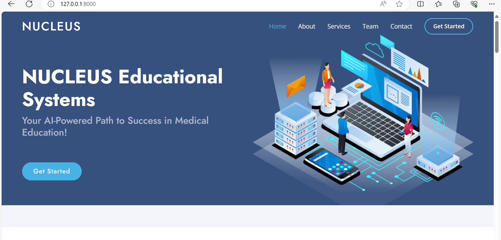

NUCLEUS-MCQ
Description
        About The Project
NUCLEUS-MCQ is a comprehensive platform designed to assist medical students in preparing for various medical examinations. It offers a vast collection of Multiple Choice Questions (MCQs) covering a wide range of medical subjects and topics, meticulously curated to align with the latest exam patterns and syllabi.

With NUCLEUS-MCQ, medical students can access a dynamic repository of practice questions to enhance their understanding of key concepts, reinforce their knowledge, and sharpen their problem-solving skills. The platform provides a user-friendly interface that allows students to navigate through different subjects, topics, and  enabling personalized learning experiences tailored to individual study needs.

Key Features:

Extensive Question Bank: Access a diverse range of MCQs spanning all major medical disciplines, including  Surgery,Anatomy, Physiology and more.
Customizable Practice Sessions: Create customized practice sessions based on specific topics or time constraints to focus on areas of weakness and track progress over time.
Detailed Explanations: Gain comprehensive insights into each question with detailed explanations and rationales provided for correct and incorrect answers, facilitating deeper comprehension and learning.
Performance Analytics: Monitor performance metrics, including accuracy rates, completion times, and topic-wise proficiency levels, to identify strengths and areas needing improvement.
User Progress Tracking: Track individual progress with personalized dashboards and performance summaries, allowing students to assess their growth and target areas for further study.
NUCLEUS-MCQ aims to empower medical aspirants with a robust study tool that not only facilitates exam preparation but also fosters critical thinking, analytical reasoning, and clinical decision-making skills essential for success in medical practice.

Setup Instructions

1.Clone the repository git clone https://github.com/Ddeepak2442/Nucleus-MCQ.git

2.Navigrate to the working directory  cd Nucleus-MCQ

3.Open the project from the code editor code . or atom .

4.Create virtual environment python -m venv env

5.Activate the virtual environment source env/Scripts/activate

6.Install required packages to run the project pip install -r requirements.txt

7.Rename .env-sample to .env

8.Fill up the environment variables: Generate your own Secret key using this tool https://djecrety.ir/, copy and paste the secret key in the SECRET_KEY field.
     Your configuration should look something like this:

    SECRET_KEY=47d)n05#ei0rg4#)*@fuhc%$5+0n(t%jgxg$)!1pkegsi*l4c%
    DEBUG=True
    EMAIL_HOST=smtp.gmail.com
    EMAIL_PORT=587
    EMAIL_HOST_USER=youremailaddress@gmail.com
    EMAIL_HOST_PASSWORD=yourStrongPassword
    EMAIL_USE_TLS=True
        Note: If you are using gmail account, make sure to use app password

9.Create database tables
        python manage.py migrate

10.Create a super user
        python manage.py createsuperuser
        
        GitBash users may have to run this to create a super user - winpty python manage.py createsuperuser

11.Run server

        python manage.py runserver
        
12.Login to admin panel - (http://127.0.0.1:8000/securelogin/)

13.Add Subjects,Topics,MCQS, register user, login, and EXPLORE SO MANY FEATURES

## Live Demo

Check out the live demo of NUCLEUS-MCQ [here](https://www.nucleus-edu.com/).

Support

💙 If you like this project, give it a ⭐ and share it with friends!

Contact Me
